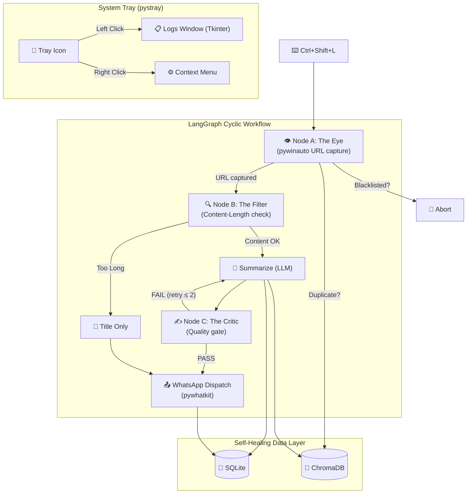

# LinkSync AI — Implementation Plan

A local-first Windows background utility that captures active browser URLs, summarizes them using a local LLM (Ollama) via a LangGraph cyclic workflow, and dispatches summaries to WhatsApp.

## Project Root

```
C:\Users\ivsan\.gemini\antigravity\scratch\linksync-ai\
```

> [!IMPORTANT]
> After scaffolding, set `C:\Users\ivsan\.gemini\antigravity\scratch\linksync-ai` as your active workspace.

---

## User Review Required

> [!IMPORTANT]
> **LLM Provider**: The plan defaults to **Ollama (local)** with `llama3` model. If you prefer an API-based provider (OpenAI, Groq, etc.), let me know and I'll adjust the LangChain integration accordingly.

> [!WARNING]
> **WhatsApp Automation**: `pywhatkit` works by automating your browser (opening WhatsApp Web, typing, and sending). It requires WhatsApp Web to be logged in on your default browser and will briefly open a browser tab each time it sends. This is a known limitation of the no-cost approach. Confirm this is acceptable.

> [!IMPORTANT]
> **Hotkey Library**: The `keyboard` library requires **admin/elevated privileges** on Windows to capture global hotkeys. The app will need to be run as Administrator or use a UAC manifest.

## Open Questions

1. **WhatsApp Recipient**: Should the default recipient phone number be configurable via the tray menu, or hardcoded in a `.env` / config file? *(Plan assumes: configurable via tray menu + persisted in config.json)*
2. **LLM Model**: Which Ollama model should be the default? `llama3`, `mistral`, `gemma2`? *(Plan assumes: `llama3`)*
3. **Polling Interval**: How frequently should the Eye node poll the active browser tab? *(Plan assumes: every 10 seconds)*
4. **"Irrelevant" Feedback Loop**: The spec mentions clicking a link in the WhatsApp message to mark as "Irrelevant." Since pywhatkit sends plain text, should we:
   - (a) Add a local HTTP server endpoint (e.g., `http://localhost:9876/irrelevant?id=xxx`) appended to each message, or
   - (b) Use the "Recent Logs" UI to let users mark entries as irrelevant?
   *(Plan assumes: option (b) — UI-based feedback via the logs window)*

---

## Architecture Overview



---

## Proposed Changes

### Project Structure

```
linksync-ai/
├── main.py                     # Entry point
├── config.py                   # App-wide configuration & constants
├── requirements.txt            # All dependencies
├── .env.example                # Environment variable template
├── assets/
│   └── icon.png                # System tray icon (generated)
├── src/
│   ├── __init__.py
│   ├── tray/
│   │   ├── __init__.py
│   │   └── system_tray.py      # pystray integration
│   ├── ui/
│   │   ├── __init__.py
│   │   └── logs_window.py      # Tkinter "Recent Logs" window
│   ├── brain/
│   │   ├── __init__.py
│   │   ├── graph.py            # LangGraph StateGraph definition
│   │   ├── eye.py              # Node A — URL detection
│   │   ├── filter_node.py      # Node B — Content filter
│   │   └── critic.py           # Node C — Summary critique
│   ├── scraper/
│   │   ├── __init__.py
│   │   └── page_scraper.py     # Playwright page scraping
│   ├── storage/
│   │   ├── __init__.py
│   │   ├── database.py         # SQLite operations
│   │   └── vector_store.py     # ChromaDB operations
│   └── dispatch/
│       ├── __init__.py
│       └── whatsapp.py         # pywhatkit WhatsApp dispatch
```

---

### Configuration & Dependencies

#### [NEW] [requirements.txt](file:///C:/Users/ivsan/.gemini/antigravity/scratch/linksync-ai/requirements.txt)

All pinned dependencies:
- `langchain`, `langchain-ollama`, `langchain-community`, `langgraph` — cognitive architecture
- `chromadb` — vector memory
- `playwright` — reliable page scraping
- `pywinauto` — active window URL capture
- `pywhatkit` — WhatsApp automation
- `pystray`, `Pillow` — system tray icon
- `keyboard` — global hotkey capture
- `python-dotenv` — environment config
- `requests` — HTTP utilities

#### [NEW] [config.py](file:///C:/Users/ivsan/.gemini/antigravity/scratch/linksync-ai/config.py)

Central configuration module:
- `BLACKLISTED_DOMAINS` — list of privacy-sensitive domains (banking, settings, localhost, etc.)
- `CONTENT_LENGTH_THRESHOLD` — 50,000 chars (triggers "Title Only" mode)
- `POLLING_INTERVAL` — 10 seconds
- `HOTKEY` — `"ctrl+shift+l"`
- `OLLAMA_MODEL` — `"llama3"`
- `OLLAMA_BASE_URL` — `"http://localhost:11434"`
- `DB_PATH` — SQLite file path
- `CHROMA_PATH` — ChromaDB persistence directory
- `CONFIG_FILE` — JSON file for user-configurable settings (WhatsApp number, pause state)
- `MAX_CRITIC_RETRIES` — 2

#### [NEW] [.env.example](file:///C:/Users/ivsan/.gemini/antigravity/scratch/linksync-ai/.env.example)

Template for optional environment overrides (`OLLAMA_MODEL`, `WHATSAPP_NUMBER`, etc.)

---

### System Tray & UI

#### [NEW] [src/tray/system_tray.py](file:///C:/Users/ivsan/.gemini/antigravity/scratch/linksync-ai/src/tray/system_tray.py)

- Creates a `pystray.Icon` with custom PNG icon
- **Left click** → opens `LogsWindow`
- **Right-click menu**:
  - `Pause Sync` / `Resume Sync` (toggle)
  - `Configure WhatsApp` → opens a simple Tkinter dialog to set phone number
  - `Exit`
- Runs on main thread; spawns the brain loop in a daemon thread

#### [NEW] [src/ui/logs_window.py](file:///C:/Users/ivsan/.gemini/antigravity/scratch/linksync-ai/src/ui/logs_window.py)

- Tkinter `Toplevel` window showing recent sync entries from SQLite
- Columns: Timestamp, URL, Summary (truncated), Status
- **"Mark Irrelevant"** button per row → adds URL embedding to ChromaDB negative filter
- Auto-refreshes on open
- Styled with a dark theme for modern look

---

### Cognitive Architecture (Brain)

#### [NEW] [src/brain/eye.py](file:///C:/Users/ivsan/.gemini/antigravity/scratch/linksync-ai/src/brain/eye.py)

**Node A — The Eye**:
- Uses `pywinauto` with `backend="uia"` to connect to the foreground window
- Detects Chrome (`.*Chrome.*`) and Edge (`.*Edge.*`) via `title_re`
- Reads the address bar value via `child_window(title="Address and search bar", control_type="Edit")`
- **Blacklist check**: Parses domain from URL → compares against `BLACKLISTED_DOMAINS` → if match, returns `abort=True` in state
- **Dedup check**: Queries ChromaDB to see if URL was already processed → if so, skips
- Returns `{url, title, abort, duplicate}` to state

#### [NEW] [src/brain/filter_node.py](file:///C:/Users/ivsan/.gemini/antigravity/scratch/linksync-ai/src/brain/filter_node.py)

**Node B — The Filter**:
- Uses Playwright to fetch the page content (async, headless)
- Extracts page text via `page.inner_text("body")`
- Checks `len(content)` against `CONTENT_LENGTH_THRESHOLD` (50k)
- If over threshold: sets `title_only=True`, extracts `<title>` only
- If under: passes full content to state for summarization
- Returns `{content, title_only, page_title}` to state

#### [NEW] [src/brain/critic.py](file:///C:/Users/ivsan/.gemini/antigravity/scratch/linksync-ai/src/brain/critic.py)

**Node C — The Critic**:
- Receives the LLM-generated summary from state
- Runs a lightweight critique function (can be LLM or heuristic):
  - **Professional tone check**: No slang, no first-person
  - **Length check**: Must be ≤ 4 lines (split by `\n`)
  - **Relevance check**: Summary must reference the page title or domain
- If FAIL and `retry_count < MAX_CRITIC_RETRIES`: increments retry counter, returns to summarization
- If PASS or retries exhausted: forwards to dispatch
- Returns `{summary, approved, retry_count}` to state

#### [NEW] [src/brain/graph.py](file:///C:/Users/ivsan/.gemini/antigravity/scratch/linksync-ai/src/brain/graph.py)

**LangGraph StateGraph**:
```python
class SyncState(TypedDict):
    url: str
    title: str
    abort: bool
    duplicate: bool
    content: str
    title_only: bool
    page_title: str
    summary: str
    approved: bool
    retry_count: int
    dispatched: bool
    error: Optional[str]
```

Graph wiring:
```
START → eye_node
eye_node → (conditional) → filter_node | END (if abort/duplicate)
filter_node → summarize_node
summarize_node → critic_node
critic_node → (conditional) → dispatch_node | summarize_node (if retry)
dispatch_node → END
```

- `summarize_node`: Uses `ChatOllama` with a prompt template to generate a 2-4 line professional summary
- Compiled with `recursion_limit=10`
- Exposes `run_sync_cycle(url: str | None = None)` function

---

### Scraper

#### [NEW] [src/scraper/page_scraper.py](file:///C:/Users/ivsan/.gemini/antigravity/scratch/linksync-ai/src/scraper/page_scraper.py)

- Manages a persistent Playwright browser context (Chromium, headless)
- `async scrape_page(url: str) -> dict` — navigates, waits for load, extracts:
  - `title` — `page.title()`
  - `content` — `page.inner_text("body")`
  - `content_length` — `len(content)`
- Handles timeouts (30s max) and network errors gracefully
- Singleton pattern for browser instance reuse

---

### Data Layer

#### [NEW] [src/storage/database.py](file:///C:/Users/ivsan/.gemini/antigravity/scratch/linksync-ai/src/storage/database.py)

SQLite operations:
- **Table: `sync_logs`** — `id, url, title, summary, status (sent|failed|skipped|irrelevant), dispatched_at, created_at`
- `init_db()` — creates tables if not exist
- `insert_log(url, title, summary, status)` → returns log ID
- `get_recent_logs(limit=50)` → list of recent entries
- `mark_irrelevant(log_id)` → updates status
- `is_url_processed(url)` → dedup check (last 24 hours)

#### [NEW] [src/storage/vector_store.py](file:///C:/Users/ivsan/.gemini/antigravity/scratch/linksync-ai/src/storage/vector_store.py)

ChromaDB operations:
- **Collection: `article_embeddings`** — stores embeddings of all processed articles
- **Collection: `negative_filter`** — stores embeddings of URLs marked "Irrelevant"
- `add_article(url, summary, metadata)` — stores in `article_embeddings`
- `add_to_negative_filter(url, summary)` — stores in `negative_filter`
- `is_similar_to_negative(summary, threshold=0.85) -> bool` — queries `negative_filter`, returns True if cosine similarity exceeds threshold
- `is_duplicate(url) -> bool` — checks if URL already exists
- Uses ChromaDB's default `all-MiniLM-L6-v2` embeddings (no external API needed)

---

### Dispatch

#### [NEW] [src/dispatch/whatsapp.py](file:///C:/Users/ivsan/.gemini/antigravity/scratch/linksync-ai/src/dispatch/whatsapp.py)

- `send_summary(phone_number, url, summary)` — formats and sends via `pywhatkit.sendwhatmsg_instantly()`
- Message format:
  ```
  🔗 LinkSync AI
  ━━━━━━━━━━━━━━
  📄 {summary}
  🌐 {url}
  ━━━━━━━━━━━━━━
  ```
- Error handling with retry (max 2 attempts)
- Logs dispatch result to SQLite

---

### Entry Point

#### [NEW] [main.py](file:///C:/Users/ivsan/.gemini/antigravity/scratch/linksync-ai/main.py)

- Loads `.env` via `python-dotenv`
- Initializes SQLite database
- Initializes ChromaDB client
- Installs Playwright browsers if needed (first-run check)
- Registers global hotkey (`Ctrl+Shift+L`) via `keyboard.add_hotkey()`
- Starts a background thread running the **polling loop** (Eye → Graph every N seconds)
- Starts the system tray icon on the main thread (blocking)
- Graceful shutdown on tray "Exit"

---

### Assets

#### [NEW] [assets/icon.png](file:///C:/Users/ivsan/.gemini/antigravity/scratch/linksync-ai/assets/icon.png)

A 64×64 tray icon — will be generated via `generate_image` tool. Design: a stylized chain-link / sync symbol in electric blue on transparent/dark background.

---

## Verification Plan

### Automated Tests

```bash
# 1. Install dependencies
pip install -r requirements.txt

# 2. Install Playwright browsers
playwright install chromium

# 3. Syntax & import check
python -c "from src.brain.graph import run_sync_cycle; print('Graph OK')"
python -c "from src.storage.database import init_db; print('DB OK')"
python -c "from src.tray.system_tray import create_tray; print('Tray OK')"

# 4. Run the app
python main.py
```

### Manual Verification

1. **Tray icon** appears in Windows system tray
2. **Right-click** shows "Pause Sync", "Configure WhatsApp", "Exit"
3. **Left-click** opens the logs window (initially empty)
4. **Ctrl+Shift+L** triggers a sync cycle on the active browser tab
5. Verify SQLite database is created at the configured path
6. Verify ChromaDB directory is created
7. Test with a sample URL → verify summary appears in logs
8. Test blacklisted domain → verify it aborts
