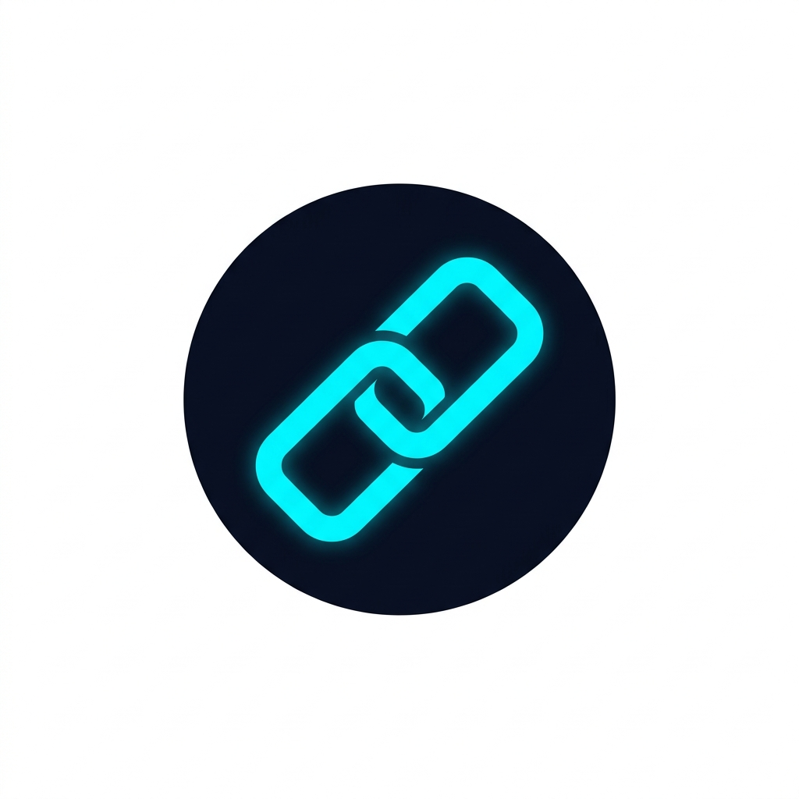

<p align="center">
  
</p>

<h1 align="center">🔗 LinkSync AI</h1>

<p align="center">
  <strong>Autonomous Browser-to-WhatsApp Sync Agent</strong><br/>
  <em>Capture browser tabs → AI-powered summaries → WhatsApp dispatch — all offline, all local.</em>
</p>

<p align="center">
  
  
  
  
  
</p>

---

## ✨ What is LinkSync AI?

LinkSync AI is a **privacy-first**, **local-first** Windows desktop agent that:

1. **Captures** all open tabs from any running browser (Chrome, Edge, Brave, Firefox, Opera, Vivaldi, DuckDuckGo)
2. **Scrapes** and **summarizes** each page using a local LLM (Ollama) through a multi-stage AI pipeline
3. **Dispatches** the formatted summaries to a specific **WhatsApp group "ME"**(sample group) — your personal knowledge inbox

No cloud APIs required. No data leaves your machine. Your browser history stays private.

---

## 🚀 Key Features

| Feature | Description |
|---|---|
| 🧠 **AI Pipeline (LangGraph)** | 4-stage cognitive architecture: Eye → Filter → Summarize → Critic with automatic retry loops |
| 🌐 **Multi-Browser Support** | Scans ALL running browsers simultaneously via CDP (Chromium) and UIA (Firefox) |
| 📱 **WhatsApp Dispatch** | Sends summaries to your "ME" group via Desktop UWP automation or WhatsApp Web fallback |
| 🔒 **Privacy Guard** | Blacklisted domains (banking, email, health) are blocked BEFORE any scraping occurs |
| 🧬 **Semantic Memory** | ChromaDB vector store deduplicates articles and learns from your "Mark Irrelevant" feedback |
| 💾 **SQLite History** | Full sync history with timestamps, domains, summaries, and dispatch status |
| ⚡ **Concurrent Processing** | Tabs are processed in parallel using `ThreadPoolExecutor` for maximum throughput |
| 🎨 **Cyberpunk UI** | Premium dark theme with electric cyan accents, neon green success states, and smooth animations |
| 🔧 **Zero Configuration** | Works out of the box — first-run bootstrap handles everything automatically |
| 🛑 **On-Demand Ollama** | Starts Ollama only during sync, stops after — zero RAM waste while idle |

---

## 🏗️ Architecture

```
User launches LinkSync AI (double-click .bat or .lnk)
        │
        ▼
┌─ Tab Capture ─────────────────────────────────────────────┐
│   tab_capture.py → CDP (all Chromium browsers) + UIA      │
│   Scans ALL running browsers simultaneously via psutil     │
└──────────────────────────────┬─────────────────────────────┘
                               │
                               ▼
┌─ Tab Selector UI ─────────────────────────────────────────┐
│   CustomTkinter popup with checkboxes per tab              │
│   Grouped by browser + window • Master group checkboxes    │
│   Blacklisted tabs greyed out • Select/deselect all        │
└──────────────────────────────┬─────────────────────────────┘
                               │ User selects → PROCEED
                               ▼
┌─ LangGraph Pipeline (Concurrent) ─────────────────────────┐
│   ┌─────────┐   ┌──────────┐   ┌───────────┐   ┌───────┐ │
│   │   Eye   │──▶│  Filter  │──▶│ Summarize │──▶│Critic │ │
│   │blacklist│   │ scrape & │   │ LLM call  │   │quality│ │
│   │ + dedup │   │ length   │   │ (Ollama)  │   │ gate  │ │
│   └────┬────┘   └──────────┘   └───────────┘   └───┬───┘ │
│        │ abort?                      retry? ◀───────┘     │
└────────┴──────────────────────────────┬────────────────────┘
                                        │
                                        ▼
┌─ Dispatch Orchestrator ───────────────────────────────────┐
│   1. WhatsApp Desktop / UWP (primary — native, fast)       │
│   2. WhatsApp Web (fallback — if Desktop unavailable)      │
│   3. Queue (last resort — saved for later)                 │
└──────────────────────────────┬─────────────────────────────┘
                               │
                               ▼
┌─ Report & Shutdown ───────────────────────────────────────┐
│   Markdown report generated + opened locally               │
│   Combined report dispatched to WhatsApp "ME" group        │
│   User clicks OK → Full shutdown (zero processes remain)   │
└───────────────────────────────────────────────────────────┘
```

---

## 📁 Project Structure

```
Linksync_AI/
├── main.py                          # Entry point — full lifecycle orchestrator
├── config.py                        # Central configuration (ALL constants)
├── requirements.txt                 # Python dependencies
├── LinkSync_AI.bat                  # One-click launcher (auto-setup on first run)
├── LinkSync_AI.lnk                  # Desktop shortcut
├── .env.example                     # Environment variable template
├── .gitignore                       # Git exclusions
├── codex.md                         # Living documentation / file catalogue
├── assets/
│   └── icon.png                     # App icon (electric cyan chain-link)
├── data/                            # Auto-generated runtime data
│   ├── linksync.db                  # SQLite sync history
│   ├── chroma/                      # ChromaDB vector embeddings
│   └── linksync.log                 # Application log file
└── src/
    ├── bootstrap/
    │   └── first_run.py             # 8-step first-time setup wizard
    ├── brain/
    │   ├── graph.py                 # LangGraph StateGraph (Eye→Filter→Summarize→Critic)
    │   ├── eye.py                   # Node A — Blacklist + dedup + negative filter
    │   ├── filter_node.py           # Node B — Scrape + adaptive summary length
    │   ├── critic.py                # Node C — Quality gate with retry loop
    │   ├── llm_provider.py          # Dual LLM: Ollama local → API fallback
    │   └── ollama_manager.py        # On-demand Ollama lifecycle manager
    ├── capture/
    │   └── tab_capture.py           # Multi-browser tab detection (CDP + UIA)
    ├── discovery/
    │   └── app_finder.py            # 6-step WhatsApp discovery hierarchy
    ├── dispatch/
    │   ├── dispatcher.py            # Orchestrator: Desktop → Web → Queue
    │   ├── whatsapp_desktop.py      # pywinauto UIA automation for WhatsApp UWP
    │   └── whatsapp_web.py          # Playwright WhatsApp Web (persistent session)
    ├── hotkey/
    │   └── global_hotkey.py         # Win32 RegisterHotKey (no admin required)
    ├── scraper/
    │   └── page_scraper.py          # Headless Playwright Chromium scraper
    ├── storage/
    │   ├── database.py              # SQLite layer (sync_logs, WAL mode)
    │   ├── vector_store.py          # ChromaDB semantic memory (2 collections)
    │   └── context_manager.py       # JSON agent memory (discovered paths, prefs)
    ├── tray/
    │   └── system_tray.py           # pystray system tray icon + menu
    └── ui/
        ├── theme.py                 # Cybersecurity dark theme constants
        ├── tab_selector.py          # Tab selection UI with progress tracking
        ├── logs_window.py           # Sync history viewer + "Mark Irrelevant"
        ├── settings_dialog.py       # Configuration form
        ├── progress_window.py       # First-run bootstrap progress UI
        └── report_generator.py      # Markdown report generator
```

---

## 📋 Prerequisites

| Requirement | Version | Notes |
|---|---|---|
| **Python** | 3.11+ | [Download](https://python.org/downloads/) — ensure "Add to PATH" is checked |
| **Windows** | 10/11 | Required for Win32 API, UIA, and UWP automation |
| **Ollama** | Latest | [Download](https://ollama.com/) — auto-detected by the app |
| **WhatsApp** | Desktop UWP or Web | UWP from Microsoft Store (preferred) or WhatsApp Web in browser |
| **A Browser** | Any | Chrome, Edge, Brave, Firefox, Opera, Vivaldi, or DuckDuckGo |

---

## ⚡ Quick Start

### Option 1: One-Click Launcher (Recommended)

**Double-click `LinkSync_AI.bat`** — that's it.

On first run, it will automatically:
1. Create a Python virtual environment (`.venv/`)
2. Install all dependencies from `requirements.txt`
3. Install Playwright's Chromium browser
4. Launch LinkSync AI

### Option 2: Manual Setup

```bash
# 1. Clone or download the project
cd "D:\Ivin\AI Projects\Linksync_AI"

# 2. Create virtual environment
python -m venv .venv

# 3. Activate it
.venv\Scripts\activate

# 4. Install dependencies
pip install -r requirements.txt

# 5. Install Playwright browser
playwright install chromium

# 6. Run!
python main.py
```

### First-Run Bootstrap

On the very first launch, LinkSync AI runs an **8-step setup wizard** with a visual progress window:

1. ✅ Python version check
2. ✅ Dependencies installation
3. ✅ Playwright browser setup
4. ✅ Browser detection
5. ✅ WhatsApp discovery (Desktop UWP / Web)
6. ✅ Ollama detection & model pull
7. ✅ Agent context initialization
8. ✅ Desktop shortcut creation

---

## 🖥️ How to Use

### Standard Workflow

1. **Open your browser(s)** with the tabs you want summarized
2. **Launch LinkSync AI** (double-click the `.bat` file or desktop shortcut)
3. **Tab Selector** appears showing all detected tabs across all browsers
   - ✅ Check/uncheck individual tabs
   - 🔒 Blacklisted tabs are greyed out (banking, email, etc.)
   - Use group checkboxes to select/deselect entire browser windows
4. **Click PROCEED** — the AI pipeline begins:
   - Ollama starts automatically (if not already running)
   - Tabs are processed concurrently
   - Real-time progress shown in the UI
5. **Results dispatched** to your WhatsApp "ME" group
6. **Report generated** — opens locally as a Markdown file
7. **Click OK** → everything shuts down cleanly (zero processes remain)

### Keyboard Shortcut

Press **`Ctrl+Shift+L`** to trigger a sync cycle at any time. Falls back to `Ctrl+Shift+K` if the primary shortcut is occupied.

---

## ⚙️ Configuration

### Environment Variables (`.env`)

Copy `.env.example` to `.env` and customize as needed. **All values are optional** — the app works fully local without any of them.

```env
# LLM API Fallback (only if Ollama is down)
OPENAI_API_KEY=sk-your-key-here
OPENAI_MODEL=gpt-4o-mini

# Alternative API Providers
GROQ_API_KEY=gsk_your-key-here
GROQ_MODEL=llama3-8b-8192

# Ollama Configuration
OLLAMA_BASE_URL=http://localhost:11434
OLLAMA_MODEL=llama3

# WhatsApp target group
WHATSAPP_GROUP=ME
```

### Config Constants (`config.py`)

| Setting | Default | Description |
|---|---|---|
| `OLLAMA_MODEL` | `llama3` | Local LLM model for summarization |
| `WHATSAPP_GROUP` | `ME` | Target WhatsApp group (safety-locked to "ME") |
| `CONTENT_LENGTH_THRESHOLD` | `50,000` chars | Pages above this use "Title Only" mode |
| `MAX_CRITIC_RETRIES` | `2` | Max LLM retry attempts for quality gate |
| `NEGATIVE_SIMILARITY_THRESHOLD` | `0.85` | Cosine similarity for negative filter |
| `HOTKEY_VK` | `L` | Virtual key for `Ctrl+Shift+L` shortcut |
| `CDP_PORT` | `9222` | Chrome DevTools Protocol port |
| `SCRAPER_TIMEOUT` | `30,000` ms | Max time for Playwright page load |

### Supported Browsers

| Browser | Detection Method | Multi-Tab Support |
|---|---|---|
| Google Chrome | CDP | ✅ All tabs |
| Microsoft Edge | CDP | ✅ All tabs |
| Brave | CDP | ✅ All tabs |
| Opera | CDP | ✅ All tabs |
| Vivaldi | CDP | ✅ All tabs |
| DuckDuckGo | CDP | ✅ All tabs |
| Firefox | UIA | ⚠️ Active tab only |

---

## 🧠 AI Pipeline Details

### Stage 1: Eye Node
- **Blacklist check** — blocks banking, email, health, system, and login domains
- **Dedup check** — queries SQLite for URLs processed in the last 24 hours
- **Negative filter** — ChromaDB cosine similarity against user-rejected articles

### Stage 2: Filter Node
- **Playwright scrape** — headless Chromium extracts page content
- **Adaptive summary length** — content size determines summary target:
  | Content Length | Max Summary Lines |
  |---|---|
  | < 5,000 chars | 3 lines |
  | 5,000 – 20,000 chars | 6 lines |
  | > 20,000 chars | 10 lines |
  | > 50,000 chars | Title Only mode |

### Stage 3: Summarize
- Uses **Ollama** (local LLM) as the primary provider
- Falls back to **OpenAI** or **Groq** API if Ollama is unavailable and keys are configured
- Provider switches trigger Windows toast notifications for transparency

### Stage 4: Critic Node
Quality gate validates each summary:
- ✅ Professional tone (no first-person, no slang)
- ✅ Appropriate length (≤ 4 lines)
- ✅ Relevance to the page title/domain
- ✅ Proper formatting
- 🔄 Up to 2 automatic retries on failure

---

## 📱 WhatsApp Dispatch

### Safety Rules (Non-Negotiable)

> ⚠️ **LinkSync AI ONLY sends messages to your personal "ME" WhatsApp group.**
> - Any other group name is rejected.
> - The agent only sends messages — it never reads, deletes, or modifies existing messages.
> - WhatsApp Web browser windows are NEVER closed by the agent.

### Dispatch Hierarchy

1. **WhatsApp Desktop / UWP** (preferred) — fastest, native automation via pywinauto
2. **WhatsApp Web** (fallback) — Playwright with persistent session (scan QR once)
3. **Queue** (last resort) — saved locally for later dispatch

### Message Format

```
🔗 LinkSync AI
━━━━━━━━━━━━━━━━━━
📄 {AI-generated summary}
🌐 {URL}
━━━━━━━━━━━━━━━━━━
```

---

## 🗄️ Data Storage

### SQLite (`data/linksync.db`)
- **`sync_logs`** table — full history of every processed tab
- Fields: `url`, `title`, `summary`, `status`, `dispatch_method`, `dispatched_at`, `created_at`
- WAL mode enabled for concurrent read/write safety

### ChromaDB (`data/chroma/`)
- **`article_embeddings`** — vector embeddings of all processed articles (dedup)
- **`negative_filter`** — embeddings of user-rejected articles (learning)
- Uses built-in `all-MiniLM-L6-v2` sentence-transformer (no external API or GPU needed)

### Agent Context (`agent_context.json`)
- JSON-based agent memory for discovered paths, preferences, and learning
- Thread-safe with atomic writes
- Persists WhatsApp path discovery results across sessions

---

## 🎨 UI Theme

LinkSync AI uses a **cybersecurity-inspired dark theme** built with [CustomTkinter](https://github.com/TomSchimansky/CustomTkinter):

| Element | Color | Hex |
|---|---|---|
| Background | Deep Navy | `#0a0e1a` |
| Cards/Panels | Dark Grey | `#111827` |
| Primary Accent | Electric Cyan | `#00f0ff` |
| Success | Neon Green | `#39ff14` |
| Error | Coral Red | `#ff3366` |
| Warning | Amber | `#fbbf24` |
| Text | Light Grey | `#e0e6ed` |

**Typography**: Segoe UI (system) + Cascadia Mono (code/logs)

---

## 🔒 Privacy & Security

- **100% Local Processing** — Ollama runs on your machine; no data sent to cloud APIs unless you explicitly configure API keys
- **Domain Blacklist** — Banking, email, health, and system URLs are blocked before any content is read
- **No Data Collection** — No telemetry, no analytics, no phone-home
- **Sandboxed WhatsApp** — Only sends to "ME" group; never reads or deletes messages
- **Agent Context** — All learned preferences stay in local JSON; never uploaded

### Blacklisted Domain Categories

| Category | Examples |
|---|---|
| Banking & Finance | `banking`, `paypal.com`, `stripe.com` |
| Email | `mail.google.com`, `outlook.live.com`, `protonmail.com` |
| System / Settings | `chrome://`, `edge://`, `localhost` |
| Authentication | `auth0.com`, `login`, `signin` |
| Health / Medical | `health`, `medical` |

---

## 🧪 Troubleshooting

### Common Issues

| Issue | Solution |
|---|---|
| **"No browser tabs detected"** | Make sure at least one browser is open before launching LinkSync AI |
| **Ollama not starting** | Ensure Ollama is installed: `ollama --version`. If missing, download from [ollama.com](https://ollama.com) |
| **WhatsApp not found** | Install WhatsApp from the [Microsoft Store](https://apps.microsoft.com/detail/9NKSQGP7F2NH) or use WhatsApp Web |
| **Hotkey not working** | `Ctrl+Shift+L` may conflict with another app. The fallback `Ctrl+Shift+K` is used automatically |
| **Playwright errors** | Run `.venv\Scripts\playwright install chromium` to install/update the browser |
| **Import errors** | Ensure you're using the project's virtual environment: `.venv\Scripts\activate` |

### Logs

Application logs are written to `data/linksync.log` with full timestamps and module names. Check this file for detailed error information.

---

## 📦 Dependencies

| Package | Role |
|---|---|
| `langchain` + `langgraph` | AI pipeline framework (LangGraph StateGraph) |
| `langchain-ollama` | Local LLM integration |
| `langchain-openai` | API fallback provider |
| `chromadb` | Vector memory (semantic dedup + negative filter) |
| `playwright` | Headless browser scraping |
| `pywinauto` | Windows UI Automation (WhatsApp Desktop + browser detection) |
| `customtkinter` | Modern dark-themed desktop UI |
| `pystray` + `Pillow` | System tray icon |
| `pywin32` | Win32 API (hotkey registration, process management) |
| `psutil` | Multi-browser process scanning |
| `python-dotenv` | Environment configuration |
| `requests` | HTTP client |
| `win10toast-click` | Windows toast notifications |

---

## 🛠️ Development

### Adding a New Browser

1. Open `config.py`
2. Add an entry to `BROWSER_REGISTRY`:
```python
"yourbrowser.exe": {
    "name": "Your Browser",
    "chromium": True,  # or False for non-Chromium
    "exe_search": "yourbrowser.exe",
    "title_pattern": r".*Your Browser$",
    "known_paths": [
        r"C:\Program Files\YourBrowser\yourbrowser.exe",
    ],
},
```
3. That's it — `tab_capture.py` will automatically detect it.

### Adding a New Blacklisted Domain

1. Open `config.py`
2. Add the domain to `BLACKLISTED_DOMAINS`:
```python
BLACKLISTED_DOMAINS = [
    # ... existing entries ...
    "newdomain.com",
]
```

### Code Conventions

- **No hardcoded values** — Everything flows from `config.py`
- **No admin privileges** — Uses `RegisterHotKey` instead of `keyboard` library
- **Loosely coupled** — Every module is independent; replace any single module without breaking others
- **Self-healing** — WhatsApp automation tries multiple element patterns and caches what works

---

## 📄 License

This project is licensed under the MIT License.

---

## 🙏 Acknowledgements

- [Ollama](https://ollama.com/) — Local LLM runtime
- [LangChain](https://www.langchain.com/) & [LangGraph](https://langchain-ai.github.io/langgraph/) — AI pipeline framework
- [ChromaDB](https://www.trychroma.com/) — Vector database
- [Playwright](https://playwright.dev/) — Browser automation
- [CustomTkinter](https://github.com/TomSchimansky/CustomTkinter) — Modern Tkinter widgets
- [pywinauto](https://pywinauto.readthedocs.io/) — Windows UI automation

---

<p align="center">
  <strong>Built with 🧠 by LinkSync AI</strong><br/>
  <em>Your browser tabs, summarized and synced — privately, locally, intelligently.</em>
</p>
